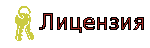

 
### Основной репозиторий сборки [White Dream](https://station13.ru/) по игре [Space Station 13](https://station13.ru/).

---

## Развёртывание
 **Работаешь с кодом впервые?**   Попробуй этот гайд, он обязательно тебя научит чему-нибудь, если будет в настроении!

## Наше сообщество
 **Крупнейшее игровое сообщество по вселенной SCP:SL.**   А также других игр, включая **Space Station 13**.

 **Это один маленький шаг для билда, но гигантский скачок для всего сообщества.**   Основной сайт пост-анимуса.

 **Ваш путеводитель по вселенной Space Station 13.**   Практически всегда актуальна.

 **Наш форум. Скопление живых трупов и заблудших душ.**   Лучшее место для свободных дискуссий на любые темы.

 **Наш Discord-сервер.**   Обязательно возьмите роль **SS 13** в канале `#▸роли`.

## Полезное
 **Наш Upstream. Ничего особенного.**   Основная часть обновлений берётся отсюда.

 **Баги и что с ними делать.**   Гарантированное решение, когда фича перерастает в проблему.

 **То, зачем мы здесь.**   Быстрое входное обучение для тех, кто желает привнести русский дух в игру.

 **Как работать с этим форматом во внешних редакторах?**   В этом руководстве описан краткий гайд по работе с иконками бьёнда.

 **Наш основной инструмент для работы с картами.**   Экономит кучу времени, заменяя встроенный редактор практически полностью.

 **Информация о правовом использовании.**   Кратко: эту кодовую базу нельзя закрыть.
